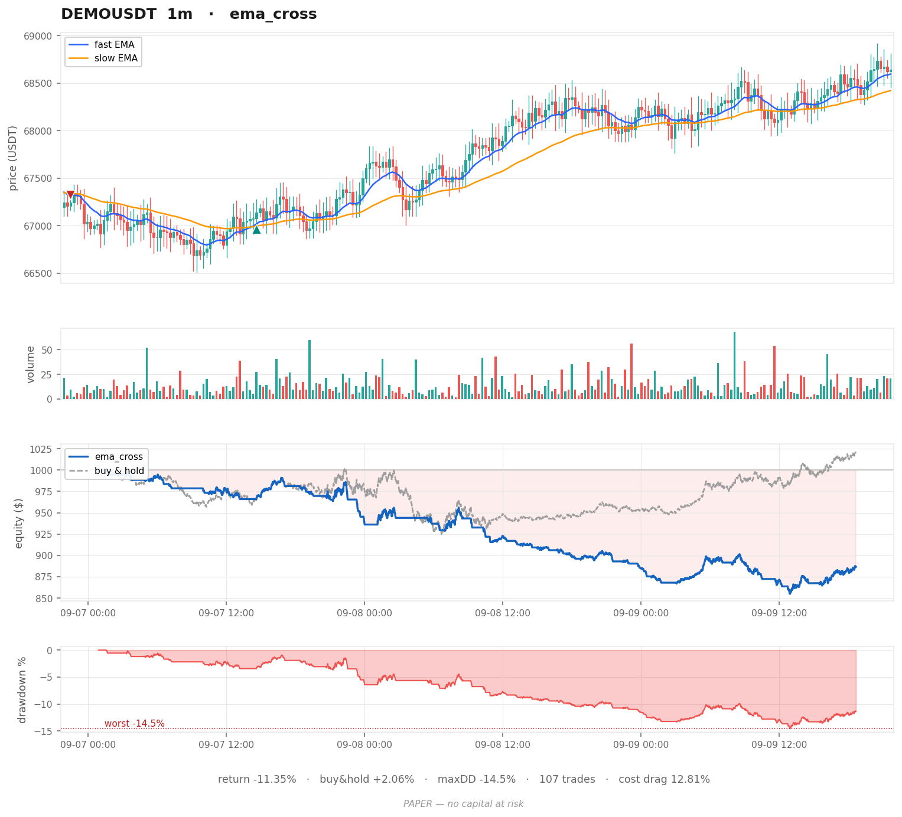

# Paper Rig

[](https://github.com/KingRam797/U-Need-Money/actions/workflows/ci.yml)

A backtesting and paper-trading harness for crypto markets. No API keys. No
credentials. No code path that can place a real order.

Built to kill bad ideas cheaply.

---

## Setup

```bash
pip install -r requirements.txt
```

That's it. Binance's public market-data endpoints need no account.

### Try it with no network

```bash
python _seed_demo.py                                    # fake candles, symbol DEMOUSDT
python run.py replay --symbol DEMOUSDT --strategy ema_cross --chart
```

### Then with real data

```bash
python feed.py BTCUSDT 1m 20000        # backfill ~14 days of 1m candles
python run.py replay --strategy ema_cross --chart
python run.py replay --strategy vol_targeted --chart
```

### Live paper trading

```bash
python run.py live --strategy vol_targeted --interval 1m --cash 1000
```

Polls for each new closed candle, marks the book, appends to `paper_log.csv`.
Ctrl-C prints a session summary. Runs indefinitely.

> Binance blocks some cloud IPs and some regions. If you get a 403 or 451,
> run it from your own machine, or swap the base URL in `feed.py` to
> `https://api.binance.us` (US endpoint, different symbol list).

---

## Files

| file | job |
|---|---|
| `feed.py` | pulls candles from Binance, caches to SQLite. Read-only. |
| `broker.py` | simulated fills with fees, slippage, and no lookahead. |
| `strategy.py` | indicator library + strategy classes. **This is your file.** |
| `run.py` | replay and live loops. |
| `chart.py` | four-panel PNG renderer. |
| `_seed_demo.py` | writes synthetic `DEMOUSDT` candles so you can run offline. |

Candles cache to `market.db`, charts render to `chart_<strategy>.png`, and live
sessions append to `paper_log.csv`. All three are gitignored — they regenerate.

---

## Tests

```bash
pip install -r requirements-dev.txt
python -m pytest tests/
```

The demo data is drawn from a fixed seed, so the whole engine is deterministic:
`ema_cross` over `DEMOUSDT` lands on -11.35% every time. The suite pins that
number, and pins the three refusals the rig is built around — fills land on the
next bar's open, every fill pays fees and slippage, and no fill can short or
borrow.

Those invariants are checked against candles that **gap**, because the seeded
demo data is gapless by construction: each bar opens at the previous close. On
gapless bars "next open" and "this close" are the same number, so a lookahead
bug would slip through unnoticed.

CI runs the suite on Python 3.10 through 3.13, then separately runs the exact
commands in this README and uploads the charts they produce.

---

## The three lies this rig refuses to tell

Every backtest that looks amazing is usually cheating in one of three ways.

**1. Lookahead.** A signal computed from a candle's close cannot be filled at
that close — the close didn't exist until the candle ended. Here, signals on
bar N always fill at bar N+1's **open**. Turn this off and coin flips look
like genius.

**2. Free execution.** Every fill pays a taker fee, both sides, every time.
Default 10 bps (0.10%). A strategy trading 100 times pays 20% of capital in
fees round-trip. That's not a detail. That's the whole result.

**3. Infinite liquidity.** Every fill also pays slippage — half the spread
plus impact. You never get the price you saw.

Look at the demo run: EMA cross returned **-11.35%** while buy-and-hold made
**+2.06%**. The gap wasn't bad signals. **Cost drag was 12.81%.** The strategy
traded itself to death.

That is the single most useful lesson in this repository.

---

## Writing your own strategy

Add a class to `strategy.py`:

```python
class MyIdea(Strategy):
    name = "my_idea"
    warmup = 100                       # bars needed before the first signal

    def prepare(self, df):             # vectorized, runs once
        df = df.copy()
        df["rsi"] = rsi(df["close"], 14)
        return df

    def weight(self, df, i):           # data up to row i ONLY
        row = df.iloc[i]
        if np.isnan(row["rsi"]):
            return 0.0
        return 1.0 if row["rsi"] < 30 else 0.0
```

Register it in `REGISTRY` at the bottom of the file. Run it.

**Rules of the road**

- Never index past `i`. Never use `df.iloc[i+1]`. That's the lookahead trap.
- Always compare against `buy_hold`. It runs automatically every replay.
- Fewer trades is usually better. Costs are the enemy, not the market.
- If it only works on one date range, it doesn't work.

---

## Reading the chart



Four panels, four questions.

**1. Candles — what happened, and how violently?**
Body = open to close. Wicks = the extremes that got rejected. A long upper
wick means buyers pushed and lost the ground. Green/red is direction; body
size is conviction; wick size is disagreement.

**2. Volume — did anyone agree?**
A move on thin volume is a few people. A move on heavy volume is consensus.
Big price move + no volume = distrust it.

**3. Equity — did you beat just holding?**
Blue is you. Dashed grey is buy-and-hold. If blue is under grey, you did
work and paid for the privilege.

**4. Drawdown — could you have lived through it?**
The only panel that predicts your behavior. A 40% drawdown on a chart is a
shrug; a 40% drawdown in your account is where people quit at the bottom.
**Size your position off this panel, not off the returns.**

---

## What this rig is not

It is not an edge. It's a truth-teller. Most ideas you put in it will lose,
and finding that out for free is the entire return on the time you spend
here.

**PAPER ONLY. Nothing here touches real money.**
